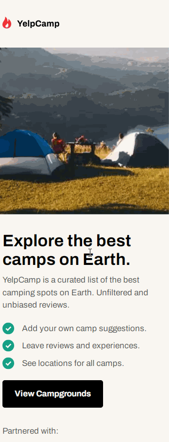

# YelpCamp Site created with Gatsby.js, MongoDB and Firebase

## Description

This website offers the exploration and rental of campsites. On the home page, you can search for campsite titles using the search bar. Users can register and log in. The campsites on the home page can be selected to open a detailed view with comments and a map from Google Maps. The entire web application is responsive.

### Motivation

I developed this web application to familiarise myself with the static site generator [Gatsby.js](https://www.gatsbyjs.com/). I used Codewell's [YelpCamp](https://www.codewell.cc/challenges/yelpcamp-by-colt-steele--6144c7c8a383e41090a3d84b) as a template for the user interface. Furthermore, I also wanted to use some Gatsby plugins, including:
- gatsby-plugin-image, to insert responsive images that do not affect the performance of the website too much.
- gatsby-source-mongodb, to include a MongoDB database
- gatsby-plugin-local-search, to include a search engine

### Features

With the help of the [Firebase](https://firebase.google.com/) development platform and the Firebase Authentication service, a user administration was created in the Gatsby.js web application.
Marcos Lombog's [blog entry](https://betterprogramming.pub/build-a-gatsby-authentication-flow-with-firebase-72b9514f6c9b) helped me to set this up.\
The campsites and comments are stored in a MongoDB database. Gatsby.js uses GraphQL to access the data. The images in the database are in base64 format. For the conversion I used this website: [base64-image](https://www.base64-image.de/).\
For the search of the campsites on the homepage I used the library [flexsearch.js](https://github.com/nextapps-de/flexsearch). The [blog entry](https://www.emgoto.com/gatsby-search/) by emma grotto helped me a lot with the implementation.\
For the styling of the website I only used [Sass](https://sass-lang.com/) with the BEM naming convention.

### Still to do

- implement firebase with the gatsby.js plugin gatsby-plugin-firebase
- replace the comments with a plugin such as [disqus](https://disqus.com/)
- use a content management system like [contenful](https://www.contentful.com/) for the data

## Languages and Tools:

      

## Installation

To use the project, the following configurations must be made:
- Change the .template.env.development file with your personal settings and change the file name to .env.development.
- create the following MongoDB collections\
[campgrounds](/collections/campgrounds.json)\
[comments](/collections/comments.json)\

## Preview

### Desktop

### Mobile

## License
This project is [0BSD](/LICENSE) licensed.